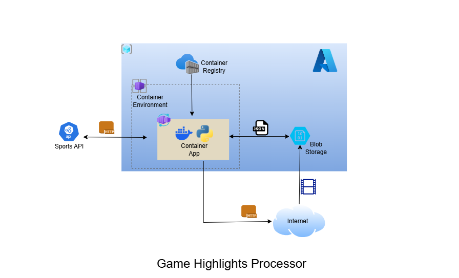

# 05_azure_highlight_processor
**Week 2 - Day 1:** Building a containerized API to fetch and store NCAA game highlights.



## Project Overview
This project uses RapidAPI to obtain NCAA game highlights, stores the json file in an Azure Blob and then parses the json file for a video url and downloads the video to the same Azure Storage Blob.

## Features
- Azure Container Apps (for running the containerized application)
- Programming Language: Python 3.x
- Containerization: Docker

## Prerequisites
- An Azure account with sufficient permissions to create resources
- Azure Service Principal for authentication
- Docker installed locally for building and pushing the container image
- Azure CLI installed and configured
- Rapid API key

## Dependencies
-  requests
-  azure-storage-blob
-  azure-identity
-  azure-mgmt-storage
-  azure.mgmt.resource
-  python-dotenv

## Project Structure
```shell
05_azure_highlight_processor/
├── config.py
├── create_storage_account.py
├── fetch.py
├── run_all.py
├── Dockerfile
├── .gitignore
├── .env
├── requirements.txt
└── README.md
```

## File Overview
1. Resource Provisioning (`create_storage_account.py`)
   - Creates a Resource Group: If it doesn’t already exist.
   - Creates a Storage Account: Dynamically provisions an Azure storage account.
   - Updates .env File: Retrieves the storage account key and updates the .env file for other scripts to use.

2. Data Fetching (`fetch.py`)
   - Fetches Highlights Data: Retrieves basketball highlights (including video URLs) from the RapidAPI Sports API.

   - Saves Data to Azure Blob Storage: Stores the fetched JSON data in Azure Blob Storage.

3. Video Processing (`process_one_video.py`)
   - Extracts Video URL: Retrieves the first video URL from the JSON data.
   - Downloads Video: Fetches the video from the external website.
   - Saves Video to Azure Blob Storage: Stores the downloaded video in Azure Blob Storage.

4. Workflow Orchestration (`run_all.py`)
   - Coordinates the Pipeline: Runs the entire workflow in sequence (resource provisioning → data fetching → video processing).
   - Retry Logic: Implements retry mechanisms for reliability.

5. Environment Variables (`.env`)
   - The `.env` file stores all sensitive configuration variables, such as:
   - Azure Credentials: Subscription ID, tenant ID, client ID, and client secret.
   - API Keys: RapidAPI Sports API key.
   - Storage Account Details: Storage account name and key.

   This approach ensures that sensitive information is not hardcoded into the scripts.

6. `Dockerfile`
   - The `Dockerfile` provides a step-by-step guide to build the container image.

## steps
1. Clone the repository
  ```shell
    git clone git@github.com:Jekwulum/05_azure_highlight_processor.git
    cd 05_azure_highlight_processor
  ```
2. Set the environment variables in the `.env` file as seen in the `.env.example` file
3. Login to Azure CLI
  ```shell
    az login
  ```
4. Create Azure Container Registry (ACR)
  ```shell
    az acr create --resource-group <ResourceGroupName> --name <ACRName> --sku Basic
  ```
5. Login to ACR
  ```shell
    az acr login --name <ACRName>
  ```
6. create a service principal
  ```shell
  az ad sp create-for-rbac --name <service-principal-name> --role contributor --scopes /subscriptions/<subscription-id>/resourceGroups/<resource-group-name>
  ```
7. set the values generated to the .env file
  ```shell
  AZURE_CLIENT_ID=your-client-id
  AZURE_TENANT_ID=your-tenant-id
  AZURE_CLIENT_SECRET=your-client-secret
  ```
8. Build, and Push the Docker Image
  ```shell
  docker build -t <ACRName>.azurecr.io/highlights-api .
  docker push <ACRName>.azurecr.io/highlights-api:latest
  # when changes are made to the files, perform these two operations again
  ```
9. Run the container app on local
  ```shell
  docker run -it --env-file .env <ACRName>.azurecr.io/highlights-api:latest
  ```
10. Deploy the Container App
    - Create a Container Apps Environment:
    - Create the Container App